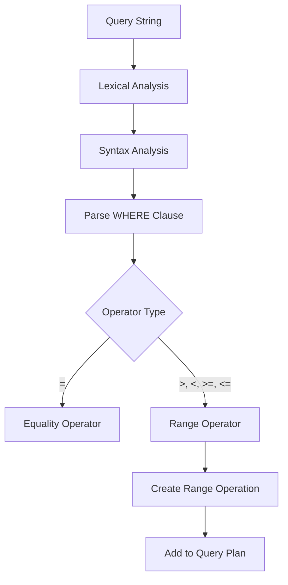
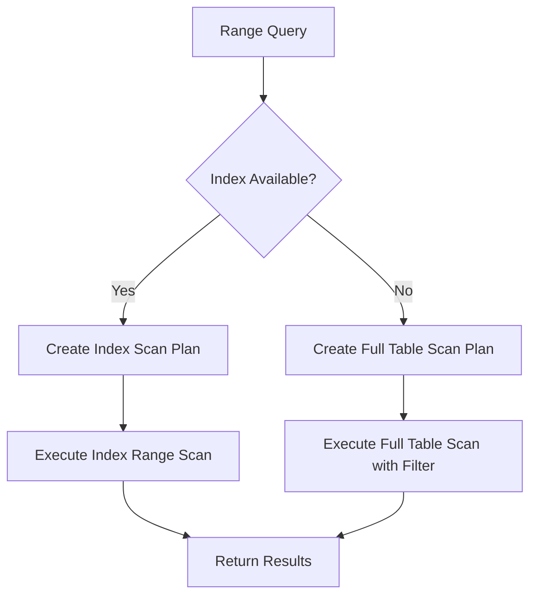
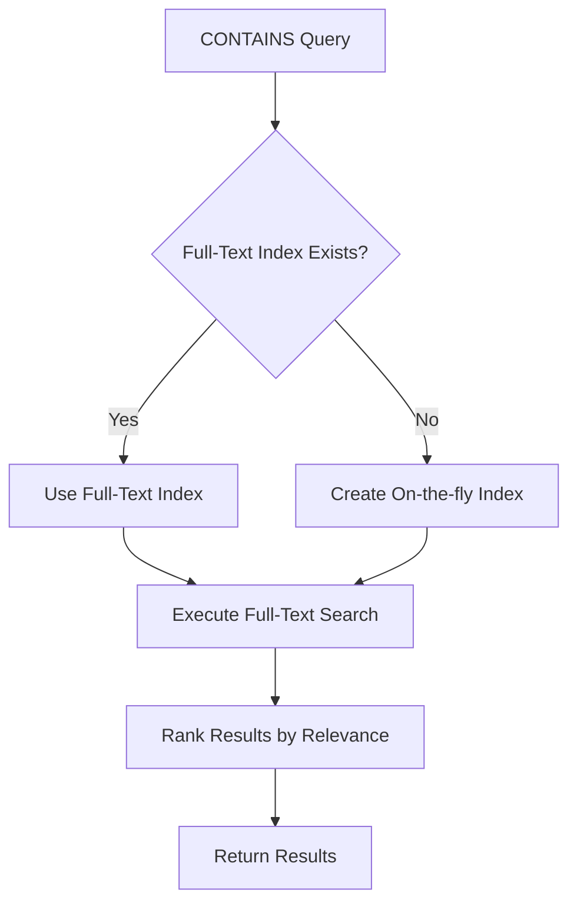
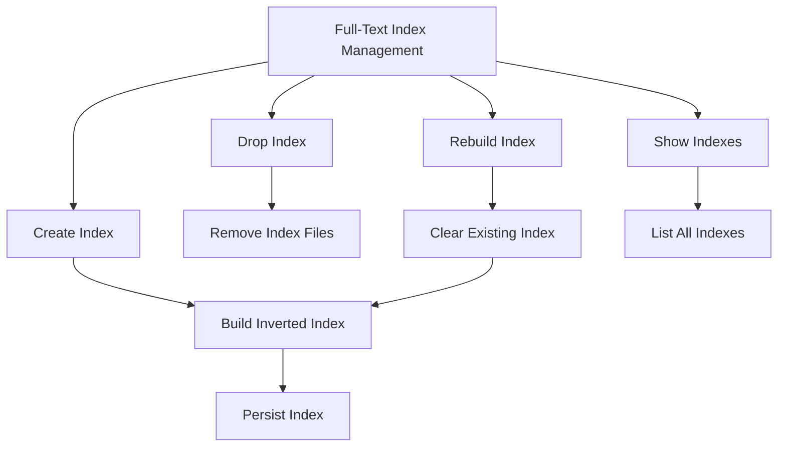
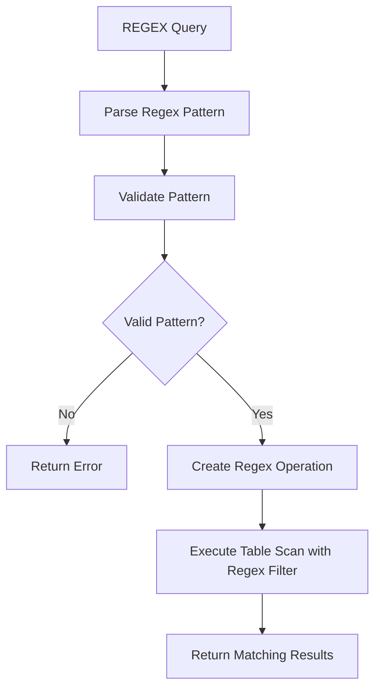
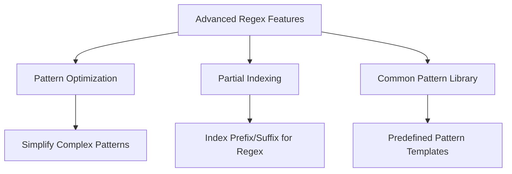
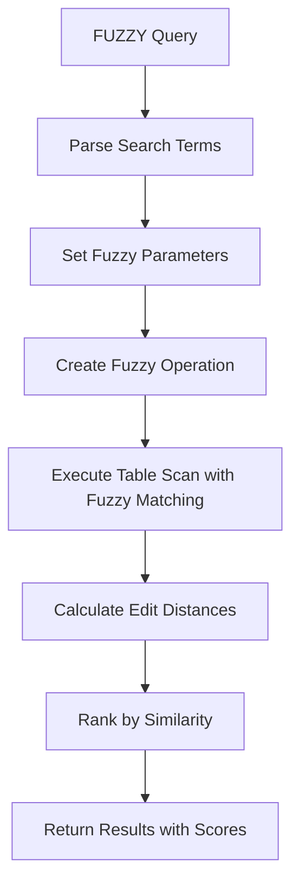
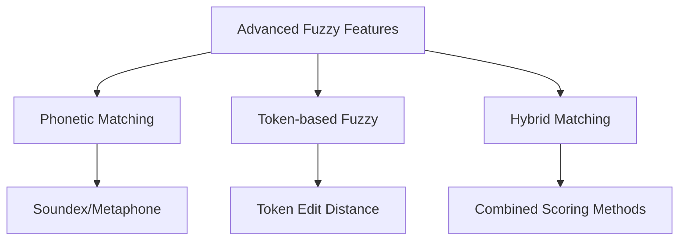
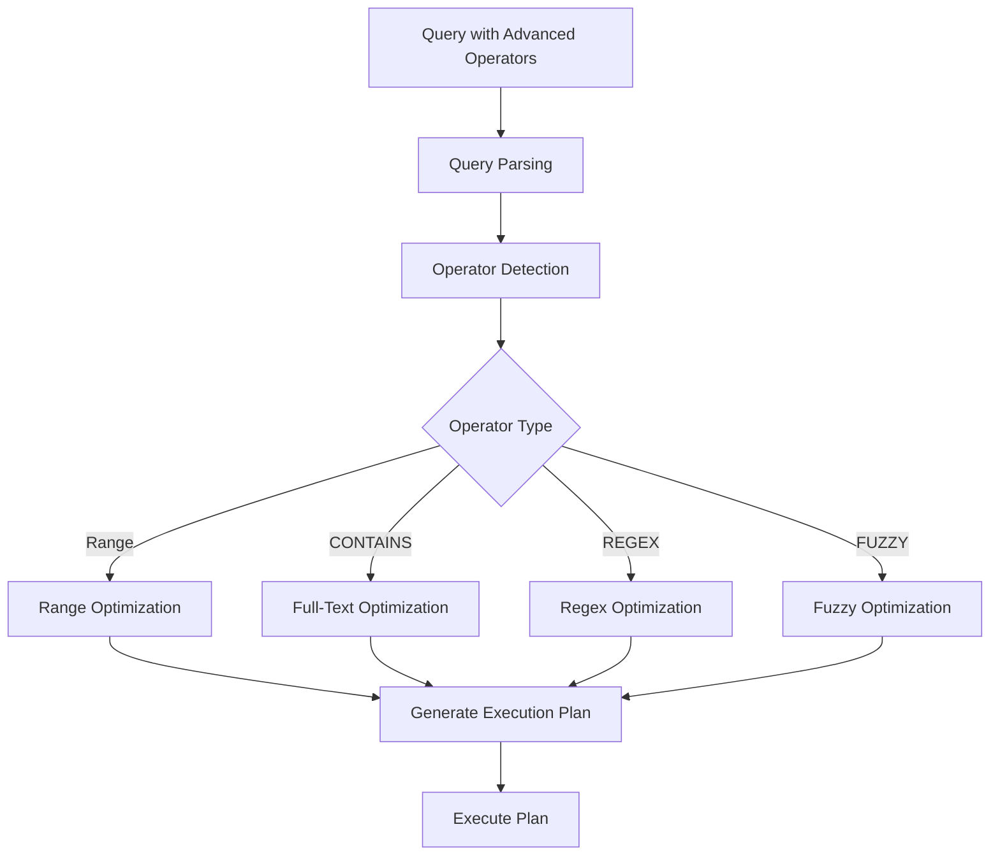
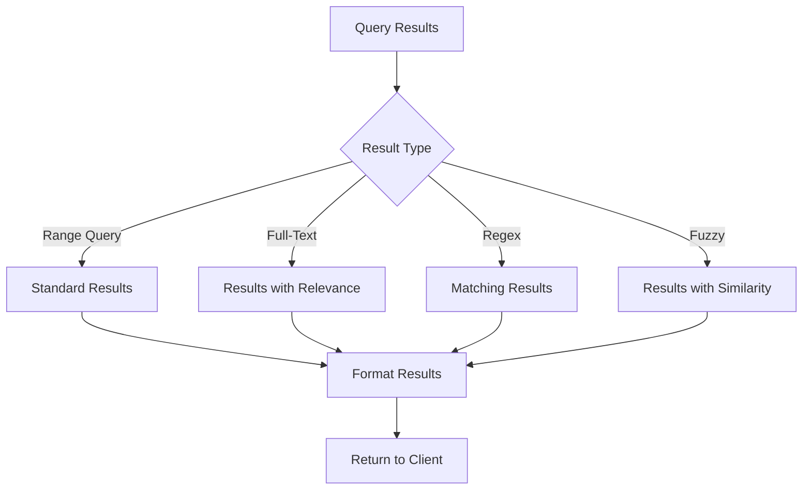

# Serengeti Advanced Search Implementation Plan

This document outlines the comprehensive plan for implementing advanced search features in the Serengeti distributed database system. These features will significantly enhance the query capabilities of the system.

## Overview

The Serengeti system currently lacks implementation for several advanced search features that are documented but not implemented:

1. **Range Queries**: Support for comparison operators (>, <, >=, <=)
2. **Full-Text Search**: Support for the CONTAINS operator
3. **Regular Expression Matching**: Support for the REGEX operator
4. **Fuzzy Matching**: Support for the FUZZY operator

These features are essential for providing powerful and flexible data retrieval capabilities to users.

## Implementation Approach

We'll implement these features in a modular fashion, with careful attention to performance and scalability. The implementation will follow these principles:

1. **Extensibility**: Design for easy addition of new operators in the future
2. **Performance**: Optimize for efficient execution, especially for large datasets
3. **Integration**: Ensure seamless integration with existing query optimization
4. **Testing**: Develop comprehensive tests for correctness and performance

## 1. Range Queries Implementation

### 1.1 Query Parser Enhancement

#### Implementation Tasks:

1. **Parser Enhancement**
   - Update the query parser to recognize range operators (>, <, >=, <=)
   - Implement proper precedence handling for complex conditions
   - Add validation for operand types (numeric, date, string)
   - Create appropriate error messages for invalid comparisons

2. **Query Plan Generation**
   - Extend `QueryPlanGenerator` to create range-based query plans
   - Implement cost estimation for range queries
   - Add optimization for range queries using indexes
   - Create specialized range scan operations

3. **Query Execution**
   - Implement range comparison logic in `QueryPlanExecutor`
   - Add support for different data types in comparisons
   - Optimize range filtering for large datasets
   - Implement index-based range scans

### 1.2 Index Utilization for Range Queries

#### Implementation Tasks:

1. **B-Tree Index Enhancement**
   - Optimize `BTreeIndex` for range queries
   - Implement efficient range scan operations
   - Add statistics collection for range query performance
   - Create specialized iterators for ascending/descending traversal

2. **Range Predicate Pushdown**
   - Implement predicate pushdown for range conditions
   - Add range-based filtering at the storage level
   - Create multi-column range support
   - Implement boundary condition optimization

3. **Performance Optimization**
   - Add caching for frequent range queries
   - Implement parallel processing for large range scans
   - Create adaptive range chunking for distributed execution
   - Add progress tracking for long-running range queries

## 2. Full-Text Search Implementation

### 2.1 CONTAINS Operator Implementation

#### Implementation Tasks:

1. **Query Parser Enhancement**
   - Update the query parser to recognize the CONTAINS operator
   - Implement parsing of search terms and phrases
   - Add support for boolean operators (AND, OR, NOT)
   - Create validation for text search parameters

2. **Full-Text Index Integration**
   - Complete integration between `QueryEngine` and `FullTextSearch`
   - Implement automatic index selection for CONTAINS queries
   - Add on-the-fly indexing for non-indexed columns
   - Create index usage statistics for optimization

3. **Search Execution**
   - Implement tokenization and term matching
   - Add relevance scoring using TF-IDF
   - Create result ranking by relevance score
   - Implement highlighting of matched terms

### 2.2 Full-Text Index Management

#### Implementation Tasks:

1. **Index Creation and Management**
   - Implement `CREATE FULLTEXT INDEX` command handling
   - Add `DROP FULLTEXT INDEX` command handling
   - Create `SHOW FULLTEXT INDEXES` command handling
   - Implement index rebuilding functionality

2. **Index Maintenance**
   - Implement automatic index updates on data changes
   - Add incremental indexing for large tables
   - Create background indexing for minimal impact
   - Implement index optimization and compaction

3. **Advanced Features**
   - Add support for stemming and lemmatization
   - Implement stopword customization
   - Create language-specific tokenization
   - Add synonym support for query expansion

## 3. Regular Expression Matching Implementation

### 3.1 REGEX Operator Implementation

#### Implementation Tasks:

1. **Query Parser Enhancement**
   - Update the query parser to recognize the REGEX operator
   - Implement regex pattern validation
   - Add error handling for invalid patterns
   - Create appropriate error messages for regex issues

2. **Regex Execution Engine**
   - Create `RegexMatcher` class for pattern matching
   - Implement efficient regex evaluation
   - Add optimization for common pattern types
   - Create pattern caching for repeated queries

3. **Performance Optimization**
   - Implement regex pre-filtering using indexes when possible
   - Add parallel processing for regex matching on large datasets
   - Create early termination for existence checks
   - Implement regex compilation caching

### 3.2 Advanced Regex Features

#### Implementation Tasks:

1. **Pattern Optimization**
   - Implement regex pattern analysis and optimization
   - Add automatic anchoring when appropriate
   - Create pattern simplification for common cases
   - Implement character class optimization

2. **Partial Indexing Support**
   - Create prefix/suffix indexing for regex acceleration
   - Implement n-gram indexing for substring matching
   - Add index utilization for anchored patterns
   - Create hybrid execution plans using indexes and regex

3. **Usability Enhancements**
   - Implement common pattern library (email, phone, etc.)
   - Add pattern templates for common use cases
   - Create regex builder helper functions
   - Implement pattern explanation for debugging

## 4. Fuzzy Matching Implementation

### 4.1 FUZZY Operator Implementation

#### Implementation Tasks:

1. **Query Parser Enhancement**
   - Update the query parser to recognize the FUZZY operator
   - Implement parsing of fuzzy search parameters
   - Add support for similarity thresholds
   - Create validation for fuzzy search inputs

2. **Fuzzy Matching Engine**
   - Create `FuzzyMatcher` class using Levenshtein distance
   - Implement efficient edit distance calculation
   - Add configurable similarity thresholds
   - Create result scoring based on edit distance

3. **Performance Optimization**
   - Implement early termination optimizations
   - Add n-gram indexing for candidate filtering
   - Create parallel processing for large datasets
   - Implement caching for repeated fuzzy queries

### 4.2 Advanced Fuzzy Features

#### Implementation Tasks:

1. **Phonetic Matching**
   - Implement Soundex algorithm for phonetic matching
   - Add Double Metaphone for improved phonetic matching
   - Create language-specific phonetic algorithms
   - Implement hybrid phonetic and edit distance matching

2. **Token-based Fuzzy Matching**
   - Implement token-based fuzzy matching for phrases
   - Add word order flexibility
   - Create partial matching for multi-word queries
   - Implement token importance weighting

3. **Advanced Scoring**
   - Create configurable scoring algorithms
   - Implement context-aware similarity scoring
   - Add field-specific similarity thresholds
   - Create combined scoring from multiple methods

## 5. Query Engine Integration

### 5.1 Query Optimizer Integration

#### Implementation Tasks:

1. **Operator Integration**
   - Update `QueryEngine` to handle all advanced operators
   - Implement operator precedence and combination rules
   - Add type checking and validation for operators
   - Create unified operator framework for extensibility

2. **Plan Generation**
   - Extend `QueryPlanGenerator` for advanced operators
   - Implement cost estimation for each operator type
   - Add plan optimization for combined operators
   - Create specialized execution plans for each operator

3. **Execution Integration**
   - Update `QueryPlanExecutor` to execute advanced operations
   - Implement result processing for each operator type
   - Add performance monitoring for advanced queries
   - Create adaptive execution based on runtime statistics

### 5.2 Result Processing and Presentation

#### Implementation Tasks:

1. **Result Formatting**
   - Implement result formatting for each operator type
   - Add metadata for search relevance/similarity scores
   - Create highlighting for matched terms/patterns
   - Implement sorting by relevance/similarity

2. **Pagination and Streaming**
   - Add pagination support for large result sets
   - Implement cursor-based pagination for efficiency
   - Create streaming results for continuous queries
   - Add early result delivery for long-running searches

3. **Client Integration**
   - Update client libraries to handle advanced search results
   - Implement result rendering in web interfaces
   - Add visualization for relevance/similarity scores
   - Create export functionality for search results

## 6. Testing Strategy

### 6.1 Functional Testing

#### Implementation Tasks:

1. **Unit Testing**
   - Create comprehensive unit tests for each operator
   - Add edge case testing for complex patterns/queries
   - Implement parameterized tests for different inputs
   - Create validation tests for error conditions

2. **Integration Testing**
   - Implement end-to-end tests for advanced search features
   - Add tests for operator combinations
   - Create tests for large datasets
   - Implement distributed testing scenarios

3. **Regression Testing**
   - Create regression test suite for all operators
   - Add performance regression tests
   - Implement compatibility tests with existing features
   - Create automated test execution in CI/CD

### 6.2 Performance Testing

#### Implementation Tasks:

1. **Benchmark Development**
   - Create benchmarks for each operator type
   - Implement dataset generation for benchmarking
   - Add variable-size dataset testing
   - Create realistic query pattern benchmarks

2. **Performance Metrics**
   - Implement latency measurement for queries
   - Add throughput testing for concurrent searches
   - Create resource utilization monitoring
   - Implement scalability testing

3. **Optimization Validation**
   - Create tests to validate optimization effectiveness
   - Implement A/B testing for optimization strategies
   - Add performance comparison with/without indexes
   - Create long-running performance tests

## 7. Implementation Timeline and Dependencies

### Phase 1: Core Framework (Weeks 1-2)
- Query parser enhancements for all operators
- Basic operator implementation
- Integration with query engine

### Phase 2: Range and Full-Text Search (Weeks 3-4)
- Complete range query implementation
- Full-text search integration
- Index utilization for both features

### Phase 3: Regex and Fuzzy Matching (Weeks 5-6)
- Regular expression matching implementation
- Fuzzy matching implementation
- Performance optimization for both features

### Phase 4: Advanced Features and Testing (Weeks 7-8)
- Advanced features for all operators
- Comprehensive testing
- Performance optimization and tuning

## 8. Risks and Mitigation

### 8.1 Technical Risks

1. **Performance Impact**
   - Risk: Advanced search operations may be computationally expensive
   - Mitigation: Implement efficient algorithms and indexing strategies
   - Monitoring: Track query performance metrics and optimize bottlenecks

2. **Memory Usage**
   - Risk: Index structures may consume significant memory
   - Mitigation: Implement memory-efficient data structures and paging
   - Monitoring: Track memory usage and implement adaptive resource management

3. **Query Complexity**
   - Risk: Complex queries may lead to exponential execution time
   - Mitigation: Implement query complexity analysis and limits
   - Monitoring: Track query execution times and alert on problematic patterns

### 8.2 Project Risks

1. **Feature Scope**
   - Risk: Advanced features may expand beyond initial requirements
   - Mitigation: Clearly define MVP features and prioritize accordingly
   - Management: Regular scope reviews and adjustment

2. **Integration Challenges**
   - Risk: Integration with existing query engine may be complex
   - Mitigation: Design for clean interfaces and incremental integration
   - Management: Frequent integration testing and validation

3. **Backward Compatibility**
   - Risk: New operators may affect existing query behavior
   - Mitigation: Maintain strict backward compatibility in parser and executor
   - Management: Comprehensive regression testing

## 9. Success Criteria

The implementation will be considered successful when:

1. All advanced search operators are fully implemented and functional
2. Performance meets or exceeds defined benchmarks
3. All tests pass, including edge cases and stress tests
4. Documentation is updated to reflect the implemented features
5. User interfaces properly support and display advanced search results

## 10. Next Steps

1. Set up development environment and branch for implementation
2. Implement query parser enhancements for all operators
3. Develop the core framework for operator handling
4. Begin implementation of range queries and full-text search
5. Create comprehensive test suite for validation