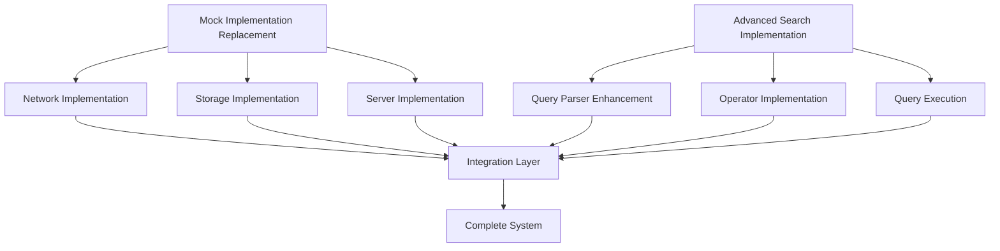

# Serengeti Master Implementation Plan

This document provides a comprehensive roadmap for implementing the identified improvements to the Serengeti distributed database system. It integrates the plans for replacing mock implementations with real ones and implementing advanced search features.

## Executive Summary

The Serengeti system requires significant improvements in two key areas:

1. **Replacing Mock Implementations**: The current system uses mock implementations for critical components (Network, Storage, Server) that need to be replaced with real, production-ready implementations.

2. **Implementing Advanced Search Features**: The system documentation describes advanced search capabilities (range queries, full-text search, regex matching, fuzzy matching) that are not yet implemented.

This master plan coordinates these efforts to ensure efficient development, proper integration, and comprehensive testing.

## Implementation Goals

### Primary Goals

1. Replace all mock implementations with production-ready code
2. Implement all documented advanced search features
3. Maintain backward compatibility with existing interfaces
4. Ensure high performance and scalability
5. Provide comprehensive testing for all new implementations

### Success Criteria

1. All mock implementations replaced with real, production-ready code
2. All advanced search operators fully implemented and functional
3. All existing and new tests pass successfully
4. Performance meets or exceeds defined benchmarks
5. Documentation updated to reflect all implementations

## Component Dependencies

### Critical Dependencies

1. **Storage Implementation** must be completed before advanced search features can be fully tested
2. **Query Parser Enhancement** is required before any operator implementation
3. **Network Implementation** is needed for distributed query testing
4. **Server Implementation** is required for API and web interface testing

## Consolidated Implementation Timeline

### Phase 1: Foundation (Weeks 1-2)

**Focus Areas:**
- Basic Network Discovery
- File System Integration
- HTTP Server Core
- Query Parser Enhancement

**Deliverables:**
- Working network discovery mechanism
- Basic file system operations for storage
- Functional HTTP server
- Enhanced query parser supporting all operators

### Phase 2: Core Functionality (Weeks 3-4)

**Focus Areas:**
- Message Passing System
- MemTable and SSTable Implementation
- Request Routing and Handling
- Range Queries and Full-Text Search

**Deliverables:**
- Functional message passing between nodes
- Working storage engine with persistence
- HTTP request routing framework
- Implemented range query and full-text search operators

### Phase 3: Advanced Features (Weeks 5-6)

**Focus Areas:**
- Failure Detection and Recovery
- Compaction Implementation
- Web Interface Serving
- Regex and Fuzzy Matching

**Deliverables:**
- Robust failure handling in network layer
- Optimized storage with compaction
- Functional web interfaces
- Implemented regex and fuzzy matching operators

### Phase 4: Integration and Testing (Weeks 7-8)

**Focus Areas:**
- Component Integration
- Comprehensive Testing
- Performance Optimization
- Documentation Updates

**Deliverables:**
- Fully integrated system
- Comprehensive test suite
- Optimized performance
- Updated documentation

## Resource Allocation

### Team Structure

For optimal execution, the implementation should be organized into three teams:

1. **Infrastructure Team**
   - Focus: Network and Server implementation
   - Skills: Distributed systems, networking, HTTP servers
   - Size: 3-4 developers

2. **Storage Team**
   - Focus: Storage and LSM engine implementation
   - Skills: Database internals, file systems, concurrency
   - Size: 3-4 developers

3. **Query Team**
   - Focus: Advanced search features implementation
   - Skills: Query processing, search algorithms, optimization
   - Size: 3-4 developers

### Cross-cutting Concerns

Some developers should be assigned to cross-cutting concerns:

1. **Integration Specialist**: Ensures components work together properly
2. **Performance Engineer**: Focuses on optimization across all components
3. **Test Engineer**: Develops comprehensive testing framework and tests

## Implementation Priorities

### Priority 1: Critical Infrastructure

1. Network Discovery
2. Basic Storage Persistence
3. HTTP Server Foundation
4. Query Parser Enhancement

### Priority 2: Core Functionality

1. Message Passing System
2. MemTable and SSTable Implementation
3. Request Routing
4. Range Query Implementation

### Priority 3: Advanced Features

1. Failure Detection and Recovery
2. Compaction Implementation
3. Web Interface Serving
4. Full-Text Search Implementation

### Priority 4: Specialized Features

1. Regex Matching
2. Fuzzy Matching
3. Advanced Optimization
4. Monitoring and Metrics

## Risk Management

### Technical Risks

| Risk | Impact | Likelihood | Mitigation |
|------|--------|------------|------------|
| Performance degradation | High | Medium | Continuous benchmarking, performance reviews |
| Data consistency issues | High | Medium | Comprehensive testing, formal verification |
| Resource consumption | Medium | High | Resource monitoring, throttling mechanisms |
| Integration failures | High | Medium | Incremental integration, interface contracts |

### Project Risks

| Risk | Impact | Likelihood | Mitigation |
|------|--------|------------|------------|
| Scope creep | Medium | High | Clear requirements, regular scope reviews |
| Timeline slippage | Medium | Medium | Buffer time, prioritization framework |
| Knowledge gaps | Medium | Medium | Training, documentation, pair programming |
| Testing complexity | High | High | Test framework investment, automation |

## Key Milestones

1. **Foundation Complete** (End of Week 2)
   - Basic network discovery working
   - File system operations functional
   - HTTP server accepting connections
   - Query parser recognizing all operators

2. **Core Functionality Complete** (End of Week 4)
   - Nodes communicating via message passing
   - Storage engine persisting data
   - Server routing requests to handlers
   - Range queries and basic search working

3. **Advanced Features Complete** (End of Week 6)
   - Network handling failures gracefully
   - Storage performing compaction
   - Web interfaces functional
   - All search operators implemented

4. **System Complete** (End of Week 8)
   - All components integrated
   - All tests passing
   - Performance meeting targets
   - Documentation updated

## Testing Strategy

### Unit Testing

- Each component should have comprehensive unit tests
- Mock dependencies for isolation
- Test edge cases and error conditions
- Measure code coverage (target: >90%)

### Integration Testing

- Test component interactions
- Focus on boundary conditions
- Test with realistic data volumes
- Include failure scenarios

### Performance Testing

- Establish performance baselines
- Regular benchmark execution
- Test with varying data sizes
- Measure resource utilization

### System Testing

- End-to-end test scenarios
- Distributed operation testing
- Chaos testing (random failures)
- Long-running stability tests

## Documentation Updates

The following documentation should be updated as part of the implementation:

1. **Component Documentation**
   - Network component
   - Storage component
   - Server component
   - Query engine and advanced search

2. **API Documentation**
   - REST API endpoints
   - Query language reference
   - Advanced search syntax

3. **Operational Documentation**
   - Deployment guide
   - Configuration reference
   - Monitoring and maintenance

4. **Developer Documentation**
   - Architecture overview
   - Component interactions
   - Extension points

## Next Steps

1. **Immediate Actions**
   - Set up development branches for implementation
   - Establish CI/CD pipeline for testing
   - Create detailed task breakdown for Phase 1
   - Assign initial development resources

2. **Week 1 Focus**
   - Begin network discovery implementation
   - Start file system integration
   - Initialize HTTP server framework
   - Begin query parser enhancement

3. **Preparation for Reviews**
   - Schedule weekly progress reviews
   - Establish performance benchmark framework
   - Create integration test environment
   - Set up documentation workflow

## Conclusion

This master implementation plan provides a comprehensive roadmap for transforming the Serengeti system from its current state with mock implementations and missing features to a production-ready distributed database with advanced search capabilities. By following this plan and carefully managing dependencies, risks, and resources, the implementation can be completed efficiently and with high quality.

The plan emphasizes a phased approach with clear milestones, allowing for regular assessment of progress and adjustment as needed. The focus on integration and testing throughout the process will ensure that the final system meets all requirements and performs well under real-world conditions.