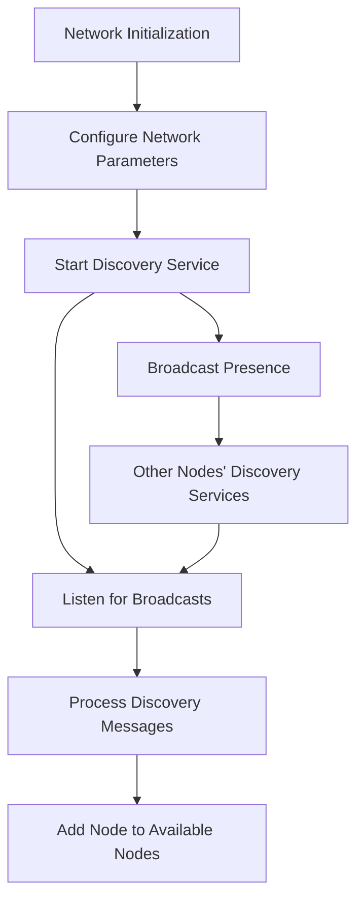
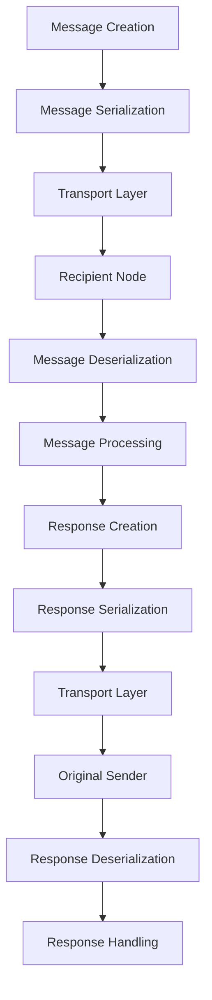
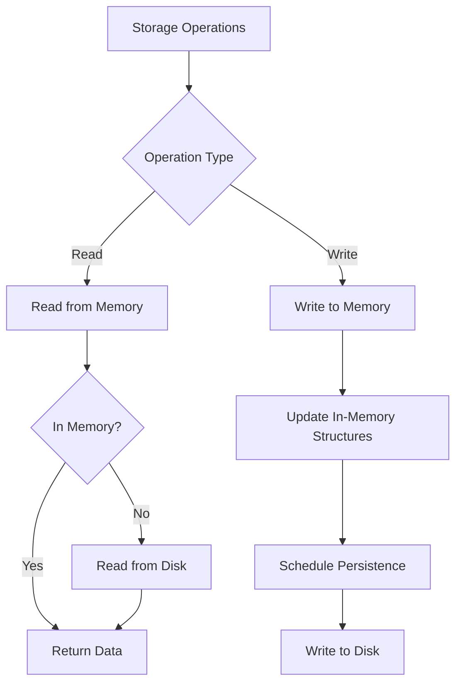
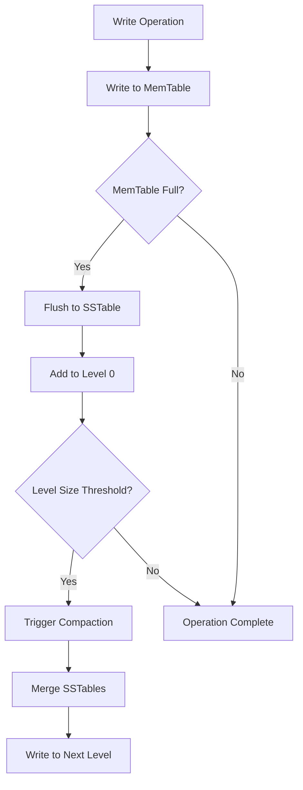
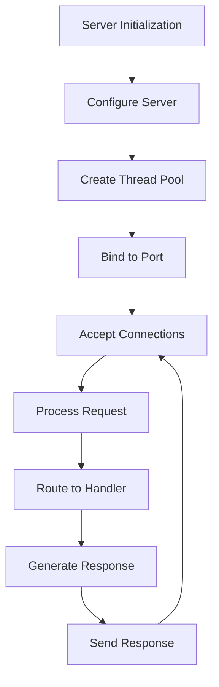

# Serengeti Mock Implementation Replacement Plan

This document outlines the comprehensive plan for replacing mock implementations with real ones in the Serengeti distributed database system. This work is foundational for the system's production readiness.

## Overview

The Serengeti system currently uses mock implementations for several critical components:
- MockNetwork
- MockStorage
- MockServer

These mock implementations need to be replaced with real, production-ready implementations that provide the actual functionality required by the system.

## Implementation Approach

We'll implement all three components in parallel, with careful attention to their integration points. The implementation will follow these principles:

1. **Interface Compatibility**: Maintain compatibility with existing interfaces to minimize disruption
2. **Incremental Development**: Implement core functionality first, then add advanced features
3. **Comprehensive Testing**: Develop tests alongside implementation to ensure correctness
4. **Performance Optimization**: Focus on efficiency and scalability from the beginning

## 1. Network Implementation

### 1.1 Network Discovery Implementation

#### Implementation Tasks:

1. **UDP Broadcast/Multicast Implementation**
   - Create `NetworkDiscoveryService` class for handling node discovery
   - Implement UDP socket for broadcasting presence on the subnet
   - Define message format for node announcements
   - Add periodic heartbeat mechanism
   - Implement discovery message handling

2. **Node Registry Management**
   - Create `NodeRegistry` class for managing available nodes
   - Implement thread-safe registry with concurrent access support
   - Add node health monitoring with status tracking
   - Implement node timeout and removal logic
   - Add node metadata storage

3. **Network Metadata Exchange**
   - Define protocol for exchanging node capabilities and metadata
   - Implement metadata synchronization between nodes
   - Add support for node role negotiation (primary/secondary)
   - Create mechanism for topology updates and propagation
   - Implement network state persistence

### 1.2 Message Passing System

#### Implementation Tasks:

1. **Message Protocol**
   - Create `Message` class hierarchy for different message types
   - Implement JSON-based serialization/deserialization
   - Add message validation and integrity checking
   - Implement message routing and addressing
   - Add support for message priorities

2. **Transport Layer**
   - Create `NetworkTransport` class for handling communication
   - Implement TCP socket communication with connection management
   - Add connection pooling for efficient node communication
   - Implement retry logic for failed transmissions
   - Add support for compression and batching

3. **Asynchronous Messaging**
   - Create thread pool for handling incoming/outgoing messages
   - Implement callback mechanism for asynchronous responses
   - Add message queuing for handling load spikes
   - Implement flow control to prevent overload
   - Add monitoring and metrics collection

### 1.3 Failure Detection and Recovery

#### Implementation Tasks:

1. **Heartbeat Mechanism**
   - Create `FailureDetector` class for monitoring node health
   - Implement periodic heartbeat messages between nodes
   - Add adaptive failure detection with configurable thresholds
   - Implement timeout configuration and management
   - Add failure notification system

2. **Partition Detection**
   - Implement algorithm to detect network partitions
   - Add split-brain prevention using quorum-based approach
   - Create partition recovery protocol for rejoining networks
   - Implement partition event handling and logging
   - Add manual partition resolution support

3. **Recovery Coordination**
   - Implement leader election for recovery coordination
   - Add data consistency verification after recovery
   - Create recovery log for tracking progress
   - Implement incremental recovery for large datasets
   - Add recovery performance optimization

## 2. Storage Implementation

### 2.1 Persistent Storage Layer

#### Implementation Tasks:

1. **File System Integration**
   - Create `FileSystemManager` class for handling file operations
   - Implement file system operations for data persistence
   - Add directory structure management and creation
   - Create file locking mechanism for concurrent access
   - Implement file integrity verification

2. **Serialization/Deserialization**
   - Create `StorageSerializer` class for object serialization
   - Implement efficient binary serialization for database objects
   - Add versioning for backward compatibility
   - Create optimized format for different object types
   - Implement lazy loading for large objects

3. **CRUD Operations**
   - Update `Storage` class to implement real operations
   - Implement create, read, update, delete operations
   - Add transaction support with ACID properties
   - Create batch operation capabilities for efficiency
   - Implement query filtering at storage level

### 2.2 LSM Storage Engine Implementation

#### Implementation Tasks:

1. **MemTable Implementation**
   - Enhance `MemTable` class with production features
   - Implement in-memory sorted structure (skip list or B+ tree)
   - Add thread-safe operations with fine-grained locking
   - Create size monitoring and automatic flushing triggers
   - Implement memory usage optimization

2. **SSTable Implementation**
   - Enhance `SSTable` class with production features
   - Implement on-disk sorted file format with blocks
   - Add bloom filter for efficient negative lookups
   - Create separate index and data files for performance
   - Implement compression for storage efficiency

3. **Compaction Implementation**
   - Create `CompactionManager` class for handling compaction
   - Implement background compaction process with thread pool
   - Add level-based compaction strategy (tiered and leveled)
   - Create compaction scheduling and throttling
   - Implement compaction priority based on benefit

### 2.3 Write-Ahead Logging

#### Implementation Tasks:

1. **WAL Format**
   - Enhance `WALManager` class with production features
   - Define efficient log entry format with checksums
   - Implement sequential log writing with buffering
   - Add group commit for improved throughput
   - Implement log file rotation

2. **Recovery Mechanism**
   - Implement log replay on startup after crash
   - Add partial recovery capabilities for corrupted logs
   - Create checkpoint mechanism to limit replay time
   - Implement parallel log replay for performance
   - Add recovery verification

3. **Log Management**
   - Implement log retention policies
   - Add log truncation after successful checkpoints
   - Create log archiving capabilities for backup
   - Implement log compaction for space efficiency
   - Add monitoring and alerting for log issues

## 3. Server Implementation

### 3.1 HTTP Server Implementation

#### Implementation Tasks:

1. **HTTP Protocol Implementation**
   - Update `Server` class with production HTTP server
   - Implement HTTP/1.1 protocol handling with proper parsing
   - Add request validation and sanitization
   - Create response generation with proper headers
   - Implement HTTP status code handling

2. **Connection Management**
   - Create `ConnectionManager` class for handling connections
   - Implement non-blocking I/O for scalability
   - Add thread pool for request processing with configurable size
   - Create connection timeout management
   - Implement graceful shutdown

3. **Request Routing**
   - Create `RequestRouter` class for handling request routing
   - Implement URL-based routing with pattern matching
   - Add handler registration mechanism with priorities
   - Create middleware support for cross-cutting concerns
   - Implement content negotiation

### 3.2 Web Interface Serving

#### Implementation Tasks:

1. **Static Resource Serving**
   - Create `ResourceManager` class for handling resources
   - Implement file-based resource serving with caching
   - Add content type detection and handling
   - Create resource versioning for cache control
   - Implement compression for text resources

2. **Dashboard Interface**
   - Update dashboard HTML generation with real-time data
   - Add AJAX support for dynamic updates
   - Create visualization components for system metrics
   - Implement interactive controls for system management
   - Add responsive design for different devices

3. **Interactive Query Interface**
   - Enhance interactive query interface with syntax highlighting
   - Add result formatting with pagination
   - Create query history and saving functionality
   - Implement query plan visualization
   - Add export functionality for results

### 3.3 API Implementation

#### Implementation Tasks:

1. **RESTful API**
   - Create `APIController` class for handling API requests
   - Implement REST endpoints for database operations
   - Add JSON request/response handling with validation
   - Create API versioning for backward compatibility
   - Implement rate limiting and throttling

2. **Query API**
   - Implement query execution endpoint with parameter validation
   - Add support for prepared statements
   - Create result pagination for large result sets
   - Implement streaming for continuous queries
   - Add query cancellation support

3. **Status API**
   - Implement system status endpoints for monitoring
   - Add health check mechanism with detailed diagnostics
   - Create metrics reporting with time series data
   - Implement alerting thresholds configuration
   - Add cluster-wide status aggregation

## 4. Integration and Testing

### 4.1 Component Integration

#### Implementation Tasks:

1. **Network-Storage Integration**
   - Implement data replication across nodes using network layer
   - Add distributed storage operations with consistency guarantees
   - Create consistency protocols (read/write quorums)
   - Implement conflict resolution strategies
   - Add partition tolerance mechanisms

2. **Server-Query Integration**
   - Implement query routing from server to query engine
   - Add result formatting for HTTP responses
   - Create streaming for large result sets
   - Implement query progress reporting
   - Add server-side caching for query results

3. **Network-Server Integration**
   - Implement distributed request handling across nodes
   - Add load balancing for query distribution
   - Create failover mechanisms for node failures
   - Implement session affinity options
   - Add distributed tracing for requests

### 4.2 Testing Strategy

#### Implementation Tasks:

1. **Unit Testing**
   - Create comprehensive unit tests for each component
   - Add edge case testing for error conditions
   - Create performance benchmarks for critical paths
   - Implement parameterized tests for different configurations
   - Add mutation testing for test quality

2. **Integration Testing**
   - Implement multi-component integration tests
   - Add distributed scenario testing with multiple nodes
   - Create failure scenario tests with fault injection
   - Implement recovery testing after failures
   - Add performance regression testing

3. **System Testing**
   - Implement end-to-end system tests with real workloads
   - Add load and stress testing with variable patterns
   - Create long-running stability tests (days/weeks)
   - Implement chaos testing with random failures
   - Add security testing for vulnerabilities

## 5. Implementation Timeline and Dependencies

### Phase 1: Core Infrastructure (Weeks 1-2)
- Basic Network Discovery
- File System Integration
- HTTP Server Core

### Phase 2: Basic Functionality (Weeks 3-4)
- Message Passing System
- MemTable and SSTable Implementation
- Request Routing and Handling

### Phase 3: Advanced Features (Weeks 5-6)
- Failure Detection and Recovery
- Compaction Implementation
- Web Interface Serving

### Phase 4: Integration and Testing (Weeks 7-8)
- Component Integration
- Comprehensive Testing
- Performance Optimization

## 6. Risks and Mitigation

### 6.1 Technical Risks

1. **Network Performance**
   - Risk: Network operations may introduce latency
   - Mitigation: Implement connection pooling, batching, and compression
   - Monitoring: Track message latency and throughput metrics

2. **Data Consistency**
   - Risk: Distributed storage may lead to consistency issues
   - Mitigation: Implement strong consistency protocols and verification
   - Monitoring: Track consistency violations and conflicts

3. **Resource Utilization**
   - Risk: Real implementations may consume more resources
   - Mitigation: Implement resource monitoring and throttling
   - Monitoring: Track memory, CPU, disk, and network usage

### 6.2 Project Risks

1. **Scope Creep**
   - Risk: Implementation may expand beyond initial requirements
   - Mitigation: Clearly define MVP features and prioritize accordingly
   - Management: Regular scope reviews and adjustment

2. **Testing Complexity**
   - Risk: Testing distributed systems is challenging
   - Mitigation: Develop comprehensive testing framework and simulation tools
   - Management: Incremental testing approach with coverage metrics

3. **Backward Compatibility**
   - Risk: Real implementations may break existing tests
   - Mitigation: Maintain interface compatibility and update tests incrementally
   - Management: Compatibility test suite for regression testing

## 7. Success Criteria

The implementation will be considered successful when:

1. All mock implementations are replaced with real, production-ready code
2. All existing tests pass with the new implementations
3. Performance meets or exceeds defined benchmarks
4. The system demonstrates stability under load and failure conditions
5. Documentation is updated to reflect the real implementations

## 8. Next Steps

1. Set up development environment and branch for implementation
2. Implement core network discovery functionality
3. Implement basic file system integration for storage
4. Implement HTTP server foundation
5. Begin integration of components with comprehensive testing