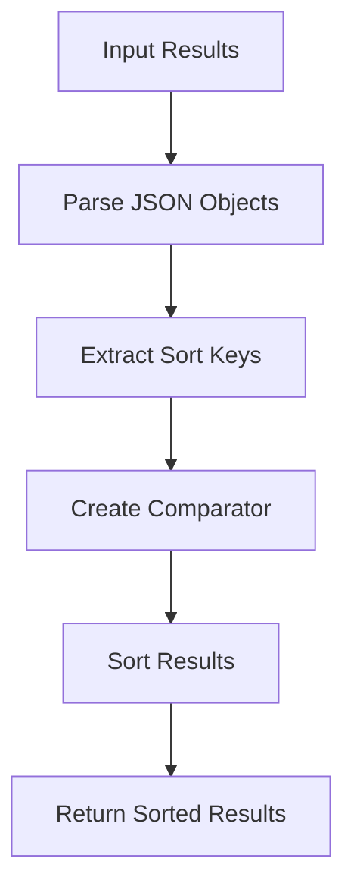
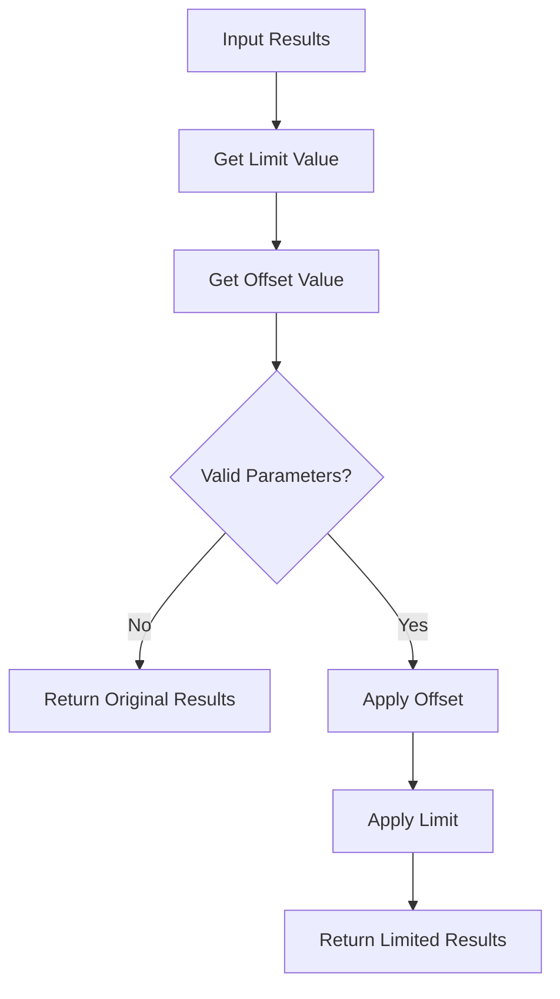
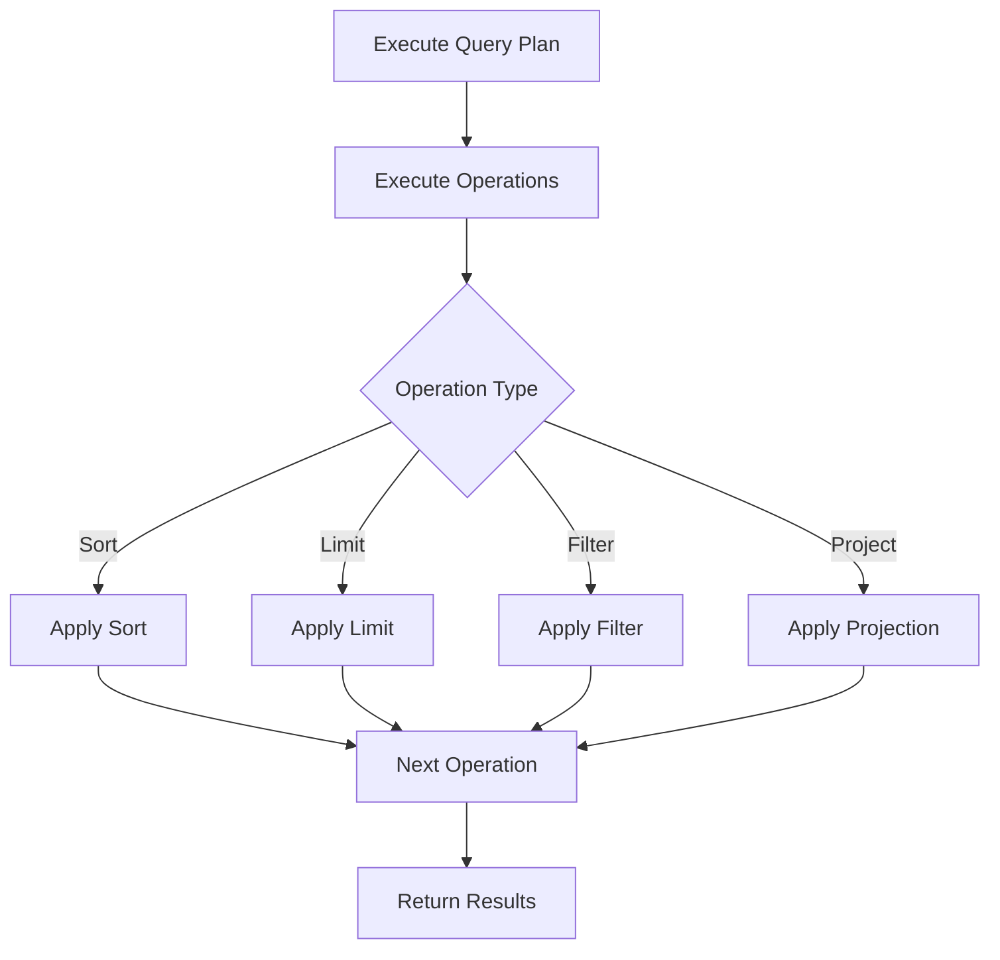

# Query Plan Executor Implementation Plan

This document outlines the plan for implementing the missing functionality in the Query Plan Executor component of the Serengeti distributed database system, specifically focusing on the `applySort` and `applyLimit` methods that are currently marked as "Not implemented yet".

## Overview

The Query Plan Executor is responsible for executing query plans generated by the Query Plan Generator. Two critical methods are currently not implemented:

1. **applySort**: Responsible for sorting query results based on specified columns and sort orders
2. **applyLimit**: Responsible for limiting the number of results returned by a query

These methods are essential for supporting ORDER BY and LIMIT clauses in SQL queries, which are fundamental features for any database system.

## Current State

Currently, the methods have placeholder implementations:

```java
private List<String> applySort(List<String> results, QueryOperation operation) {
    // Not implemented yet
    return results;
}

private List<String> applyLimit(List<String> results, QueryOperation operation) {
    // Not implemented yet
    return results;
}
```

These methods simply return the input results without applying any sorting or limiting, which means ORDER BY and LIMIT clauses in queries are effectively ignored.

## Implementation Goals

1. Implement efficient sorting of query results based on specified columns and sort orders
2. Implement result limiting with proper offset support
3. Ensure compatibility with existing query execution flow
4. Optimize for performance, especially for large result sets
5. Add comprehensive testing for the new functionality

## Implementation Plan

### 1. Sort Implementation

#### 1.1 Design



#### 1.2 Implementation Tasks

1. **Result Parsing**
   - Parse JSON strings into objects for comparison
   - Handle potential parsing errors gracefully
   - Optimize parsing for performance

2. **Sort Key Extraction**
   - Extract sort columns from the QueryOperation
   - Support multiple sort columns with different directions
   - Handle missing values in sort columns

3. **Comparator Implementation**
   - Create a flexible comparator for different data types
   - Support ascending and descending sort orders
   - Implement null handling (nulls first or last)
   - Add case-sensitive and case-insensitive string comparison

4. **Sorting Algorithm**
   - Use efficient sorting algorithm for different data sizes
   - Implement external sorting for very large result sets
   - Add parallel sorting for large datasets

5. **Result Reconstruction**
   - Maintain original JSON format in sorted results
   - Ensure no data loss during sort operation
   - Preserve metadata in results

#### 1.3 Code Structure

```java
/**
 * Sorts the results based on the sort operation parameters.
 *
 * @param results The results to sort
 * @param operation The sort operation with column and direction information
 * @return The sorted results
 */
private List<String> applySort(List<String> results, QueryOperation operation) {
    if (results == null || results.isEmpty()) {
        return results;
    }
    
    // Extract sort columns and directions
    String[] sortColumns = operation.getSortColumns();
    boolean[] ascending = operation.getSortDirections();
    
    if (sortColumns == null || sortColumns.length == 0) {
        return results;
    }
    
    // Parse results into JSON objects for sorting
    List<JSONObject> jsonResults = parseResults(results);
    
    // Create comparator for the specified columns and directions
    Comparator<JSONObject> comparator = createComparator(sortColumns, ascending);
    
    // Sort the results
    Collections.sort(jsonResults, comparator);
    
    // Convert back to string format
    return convertToStringResults(jsonResults);
}

/**
 * Creates a comparator for JSON objects based on specified columns and sort directions.
 */
private Comparator<JSONObject> createComparator(String[] columns, boolean[] ascending) {
    // Implementation details
}

/**
 * Parses string results into JSON objects.
 */
private List<JSONObject> parseResults(List<String> results) {
    // Implementation details
}

/**
 * Converts JSON objects back to string results.
 */
private List<String> convertToStringResults(List<JSONObject> jsonResults) {
    // Implementation details
}
```

### 2. Limit Implementation

#### 2.1 Design



#### 2.2 Implementation Tasks

1. **Parameter Extraction**
   - Extract limit and offset values from the QueryOperation
   - Validate parameter values (non-negative, within bounds)
   - Handle default values when parameters are missing

2. **Offset Handling**
   - Implement offset to skip initial results
   - Handle cases where offset exceeds result count
   - Optimize to avoid unnecessary processing of skipped results

3. **Limit Application**
   - Apply limit to restrict number of returned results
   - Handle special cases (limit = 0, very large limits)
   - Optimize memory usage for large result sets

4. **Integration with Paging**
   - Support cursor-based pagination for efficiency
   - Add metadata for total result count
   - Implement consistent ordering for reliable paging

#### 2.3 Code Structure

```java
/**
 * Limits the results based on the limit operation parameters.
 *
 * @param results The results to limit
 * @param operation The limit operation with limit and offset information
 * @return The limited results
 */
private List<String> applyLimit(List<String> results, QueryOperation operation) {
    if (results == null || results.isEmpty()) {
        return results;
    }
    
    // Extract limit and offset values
    int limit = operation.getLimit();
    int offset = operation.getOffset();
    
    // Validate parameters
    if (limit <= 0 && offset <= 0) {
        return results; // No limiting needed
    }
    
    // Calculate start and end indices
    int startIndex = Math.min(offset, results.size());
    int endIndex = (limit <= 0) 
        ? results.size() 
        : Math.min(startIndex + limit, results.size());
    
    // Apply limit and offset
    return results.subList(startIndex, endIndex);
}
```

### 3. Integration with Query Execution

#### 3.1 Design



#### 3.2 Implementation Tasks

1. **Operation Ordering**
   - Ensure operations are executed in the correct order
   - Apply sort before limit for correct results
   - Handle dependencies between operations

2. **Query Plan Integration**
   - Update query plan execution to use the new methods
   - Ensure compatibility with existing operation types
   - Add proper error handling and logging

3. **Performance Optimization**
   - Implement early limiting when possible
   - Add sort-limit fusion for optimization
   - Optimize memory usage for large result sets

#### 3.3 Code Structure

```java
/**
 * Executes a query plan and returns the results.
 *
 * @param plan The query plan to execute
 * @return The query results
 */
public List<String> execute(QueryPlan plan) {
    // Initial data retrieval
    List<String> results = retrieveData(plan);
    
    // Execute each operation in the plan
    for (QueryOperation operation : plan.getOperations()) {
        switch (operation.getType()) {
            case FILTER:
                results = applyFilter(results, operation);
                break;
            case PROJECT:
                results = applyProjection(results, operation);
                break;
            case SORT:
                results = applySort(results, operation);
                break;
            case LIMIT:
                results = applyLimit(results, operation);
                break;
            // Other operation types
        }
    }
    
    return results;
}
```

### 4. Testing Strategy

#### 4.1 Unit Testing

1. **Sort Testing**
   - Test sorting with different data types (numeric, string, date)
   - Test ascending and descending sort orders
   - Test multi-column sorting
   - Test edge cases (empty results, null values, etc.)
   - Test performance with large result sets

2. **Limit Testing**
   - Test basic limit functionality
   - Test offset functionality
   - Test combinations of limit and offset
   - Test edge cases (limit = 0, offset > results, etc.)
   - Test performance with large result sets

#### 4.2 Integration Testing

1. **Query Execution Testing**
   - Test complete query execution with sort and limit
   - Test interaction with other operation types
   - Test complex queries with multiple operations
   - Test distributed query execution

2. **SQL Query Testing**
   - Test SQL queries with ORDER BY clause
   - Test SQL queries with LIMIT clause
   - Test SQL queries with both ORDER BY and LIMIT
   - Test with real-world query patterns

#### 4.3 Performance Testing

1. **Benchmark Development**
   - Create benchmarks for sort and limit operations
   - Test with varying result set sizes
   - Measure memory consumption
   - Compare with baseline performance

2. **Optimization Validation**
   - Validate effectiveness of performance optimizations
   - Test with different data distributions
   - Measure impact on query execution time
   - Identify bottlenecks for further optimization

## Implementation Timeline

### Week 1: Design and Basic Implementation

- Day 1-2: Design and implement basic sort functionality
- Day 3-4: Design and implement basic limit functionality
- Day 5: Integration with query execution flow

### Week 2: Optimization and Testing

- Day 1-2: Implement performance optimizations
- Day 3-4: Develop comprehensive test suite
- Day 5: Performance testing and final adjustments

## Risks and Mitigation

### Technical Risks

1. **Performance Issues**
   - Risk: Sorting large result sets may be slow
   - Mitigation: Implement efficient sorting algorithms, external sorting for large datasets, and early limiting when possible

2. **Memory Consumption**
   - Risk: Large result sets may consume excessive memory
   - Mitigation: Implement streaming processing, pagination, and memory-efficient data structures

3. **Correctness Issues**
   - Risk: Complex sorting logic may have edge cases
   - Mitigation: Comprehensive testing with diverse data types and edge cases

### Project Risks

1. **Integration Challenges**
   - Risk: Changes may affect existing query execution
   - Mitigation: Maintain backward compatibility and add extensive integration tests

2. **Scope Expansion**
   - Risk: Requirements may expand during implementation
   - Mitigation: Clearly define MVP features and prioritize accordingly

## Success Criteria

The implementation will be considered successful when:

1. The `applySort` and `applyLimit` methods are fully implemented
2. All tests pass, including edge cases and performance tests
3. SQL queries with ORDER BY and LIMIT clauses work correctly
4. Performance meets or exceeds defined benchmarks
5. The implementation is well-documented and maintainable

## Next Steps

1. Review and finalize the design for both methods
2. Implement the basic functionality for sorting
3. Implement the basic functionality for limiting
4. Integrate with the query execution flow
5. Develop comprehensive tests
6. Optimize for performance
7. Document the implementation