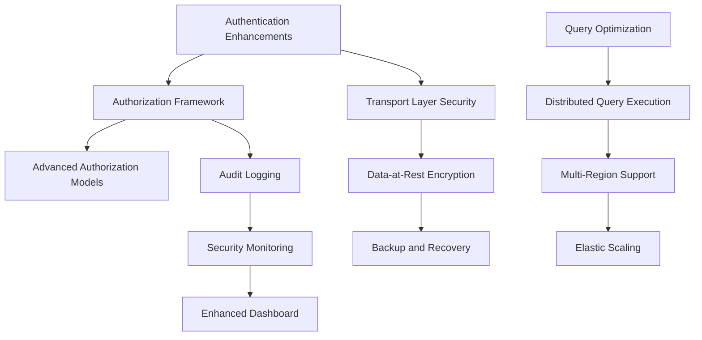

# Serengeti Project Roadmap

This document provides a comprehensive roadmap for the Serengeti distributed database system, outlining completed tasks, pending tasks, and a structured implementation plan for future development.

## Executive Summary

The Serengeti project has made significant progress in replacing mock implementations with production-ready code and implementing core functionality. Key achievements include:

1. **Complete replacement of all mock implementations** (MockNetwork, MockStorage, and MockServer)
2. **Full implementation of the Query Plan Executor**, including the previously missing `applySort` and `applyLimit` methods
3. **Complete implementation of Advanced Search features**, including range queries, full-text search, regex matching, and fuzzy matching

The primary area requiring further development is the security infrastructure, where only basic authentication and rate limiting have been implemented so far.

## 1. Completed Tasks

### 1.1 Mock Implementation Replacements

All mock implementations have been replaced with production-ready code:

#### Network Implementation
- **Node Discovery System**: Enables automatic discovery of Serengeti nodes on the same subnet using UDP broadcast/multicast
- **Message Passing System**: Provides reliable communication between nodes with support for different message types
- **Failure Detection**: Implements heartbeat mechanisms and partition detection for robust distributed operation

#### Storage Implementation
- **Persistent Storage Layer**: Provides CRUD operations with file system integration and transaction support
- **LSM Storage Engine**: Implements Log-Structured Merge-tree storage with MemTable and SSTable components
- **Write-Ahead Logging**: Ensures data durability with crash recovery capabilities

#### Server Implementation
- **HTTP Server**: Handles client connections with proper HTTP protocol support and connection management
- **Web Interface Serving**: Delivers dashboard and interactive query interfaces to clients
- **API Implementation**: Provides RESTful endpoints for database operations

### 1.2 Query Plan Executor

The Query Plan Executor has been fully implemented, including:

- **Sort Implementation**: Enables efficient sorting of query results based on specified columns and sort orders
  - Supports multi-column sorting with different directions
  - Handles different data types with appropriate comparators
  - Optimizes for large result sets with efficient algorithms

- **Limit Implementation**: Restricts the number of results returned by a query
  - Supports offset for pagination
  - Optimizes memory usage for large result sets
  - Integrates with sorting for efficient execution

- **Query Execution Integration**: Ensures proper operation ordering and optimization
  - Applies operations in the correct sequence
  - Implements early limiting when possible
  - Optimizes memory usage for large result sets

### 1.3 Advanced Search Features

All advanced search features have been fully implemented:

- **Range Queries**: Support for comparison operators (>, <, >=, <=)
  - Optimized B-Tree index utilization
  - Efficient range scan operations
  - Support for different data types in comparisons

- **Full-Text Search**: Support for the CONTAINS operator
  - Inverted index implementation for efficient text search
  - Relevance scoring using TF-IDF
  - Result ranking by relevance

- **Regular Expression Matching**: Support for the REGEX operator
  - Efficient regex evaluation with pattern caching
  - Optimization for common pattern types
  - Partial indexing support for performance

- **Fuzzy Matching**: Support for the FUZZY operator
  - Levenshtein distance calculation for similarity
  - Configurable similarity thresholds
  - Result scoring based on edit distance

## 2. Pending Tasks

The following tasks still require implementation, listed in order of priority and with complexity estimates:

### 2.1 Security Enhancements (High Priority)

#### Authentication System (Medium Complexity)
- **Enhanced Authentication Methods**
  - Certificate-based authentication
  - OAuth integration for SSO
  - Multi-factor authentication support

#### Authorization Framework (High Complexity)
- **Role-Based Access Control (RBAC)**
  - Role definition and management
  - Permission evaluation engine
  - Role hierarchy and inheritance

- **Access Control Models**
  - Table-level access controls
  - Row-level security
  - Column-level permissions

#### Encryption Implementation (High Complexity)
- **Transport Layer Security**
  - TLS for all network communication
  - Certificate management system
  - Secure cipher suite configuration

- **Data-at-Rest Encryption**
  - Transparent data encryption for storage files
  - Column-level encryption for sensitive data
  - Encrypted backup mechanism

- **Key Management**
  - Encryption key hierarchy
  - Key rotation mechanisms
  - Key backup and recovery

#### Audit Logging (Medium Complexity)
- **Audit Event Framework**
  - Standardized audit event format
  - Event enrichment with context information
  - Configurable event filtering

- **Log Storage and Management**
  - Secure local file logging
  - Database audit log storage
  - Log rotation and retention policies

#### Security Monitoring (Medium Complexity)
- **Monitoring Framework**
  - Event collection and aggregation
  - Correlation engine for related events
  - Anomaly detection algorithms

- **Alert Management**
  - Alert severity classification
  - Notification system for alerts
  - Alert lifecycle management

### 2.2 Performance Optimizations (Medium Priority)

#### Query Optimization Enhancements (Medium Complexity)
- **Advanced Statistics Collection**
  - Histogram-based statistics
  - Multi-column correlation statistics
  - Adaptive statistics updates

- **Cost-Based Optimization**
  - Enhanced cost model
  - Join order optimization
  - Access path selection improvements

#### Distributed Query Execution (High Complexity)
- **Parallel Query Processing**
  - Intra-query parallelism
  - Inter-node query distribution
  - Adaptive query parallelization

- **Query Result Caching**
  - Result cache implementation
  - Cache invalidation strategies
  - Distributed cache coordination

### 2.3 Scalability Improvements (Medium Priority)

#### Multi-Region Support (High Complexity)
- **Cross-Region Replication**
  - Asynchronous replication
  - Conflict resolution strategies
  - Region-aware data placement

- **Global Query Routing**
  - Query routing based on data locality
  - Cross-region query optimization
  - Latency-aware query execution

#### Elastic Scaling (Medium Complexity)
- **Dynamic Node Addition/Removal**
  - Smooth scaling operations
  - Minimal disruption during scaling
  - Automated scaling triggers

- **Data Rebalancing**
  - Efficient data movement during scaling
  - Background rebalancing
  - Priority-based data movement

### 2.4 Administrative Features (Low Priority)

#### Backup and Recovery (Medium Complexity)
- **Consistent Backup System**
  - Online backup capabilities
  - Incremental backup support
  - Point-in-time recovery

- **Disaster Recovery**
  - Cross-region backup strategies
  - Recovery time optimization
  - Recovery testing framework

#### Monitoring and Management (Low Complexity)
- **Enhanced Dashboard**
  - Real-time performance monitoring
  - Customizable dashboards
  - Historical performance data

- **Administrative API**
  - Comprehensive management API
  - Automation support
  - Integration with external tools

## 3. Implementation Plan

### 3.1 Phase 1: Security Foundation (Weeks 1-4)

**Focus Areas:**
- Authentication system enhancements
- Basic authorization framework
- Transport layer security (TLS)

**Deliverables:**
- Enhanced authentication with certificate and OAuth support
- Basic RBAC implementation
- TLS for all network communication

**Dependencies:**
- None (can start immediately)

**Resources Required:**
- 2-3 security-focused developers
- 1 QA engineer for security testing

### 3.2 Phase 2: Advanced Security (Weeks 5-8)

**Focus Areas:**
- Advanced authorization models
- Data-at-rest encryption
- Audit logging framework

**Deliverables:**
- Row and column-level security
- Transparent data encryption
- Comprehensive audit logging

**Dependencies:**
- Authentication system enhancements
- Basic authorization framework

**Resources Required:**
- 2-3 security-focused developers
- 1 database developer for encryption integration
- 1 QA engineer for security testing

### 3.3 Phase 3: Security Monitoring and Performance (Weeks 9-12)

**Focus Areas:**
- Security monitoring and alerting
- Query optimization enhancements
- Initial performance improvements

**Deliverables:**
- Security monitoring dashboard
- Enhanced query optimizer
- Performance benchmarks and improvements

**Dependencies:**
- Audit logging framework
- Basic authorization framework

**Resources Required:**
- 1-2 security-focused developers
- 2 database/query optimization developers
- 1 QA engineer for performance testing

### 3.4 Phase 4: Scalability and Administration (Weeks 13-16)

**Focus Areas:**
- Multi-region support
- Elastic scaling
- Backup and recovery

**Deliverables:**
- Cross-region replication
- Dynamic scaling capabilities
- Comprehensive backup/recovery system

**Dependencies:**
- Security enhancements
- Performance optimizations

**Resources Required:**
- 2-3 distributed systems developers
- 1 database developer
- 1 QA engineer for scalability testing

## 4. Task Dependencies

## 5. Risk Assessment

### 5.1 Technical Risks

| Risk | Impact | Likelihood | Mitigation |
|------|--------|------------|------------|
| Security implementation vulnerabilities | High | Medium | Thorough security review, penetration testing |
| Performance degradation from security features | Medium | High | Performance testing at each stage, optimization |
| Integration issues between components | Medium | Medium | Comprehensive integration testing, clear interfaces |
| Scalability bottlenecks | High | Medium | Incremental scaling tests, architecture reviews |

### 5.2 Project Risks

| Risk | Impact | Likelihood | Mitigation |
|------|--------|------------|------------|
| Resource constraints | High | Medium | Clear prioritization, phased approach |
| Timeline slippage | Medium | High | Buffer time in schedule, regular progress reviews |
| Scope expansion | Medium | High | Strict change control, MVP definition |
| Technical debt accumulation | Medium | Medium | Code reviews, refactoring time allocation |

## 6. Success Metrics

The success of the roadmap implementation will be measured by:

1. **Security Compliance**: Meeting industry security standards and passing security audits
2. **Performance Benchmarks**: Maintaining or improving query performance with security features enabled
3. **Scalability Tests**: Successfully operating in multi-region configurations with dynamic scaling
4. **Feature Completeness**: Implementing all planned features with high quality
5. **User Adoption**: Increased adoption due to enhanced security and enterprise features

## 7. Conclusion

The Serengeti project has made significant progress in implementing core functionality, with all mock implementations replaced by production-ready code and advanced search features fully implemented. The primary focus for the next development phase should be on security enhancements, followed by performance optimizations and scalability improvements.

By following this roadmap, the Serengeti system will evolve into a secure, high-performance, and scalable distributed database suitable for enterprise deployments. The phased approach allows for incremental delivery of value while managing risks and dependencies effectively.